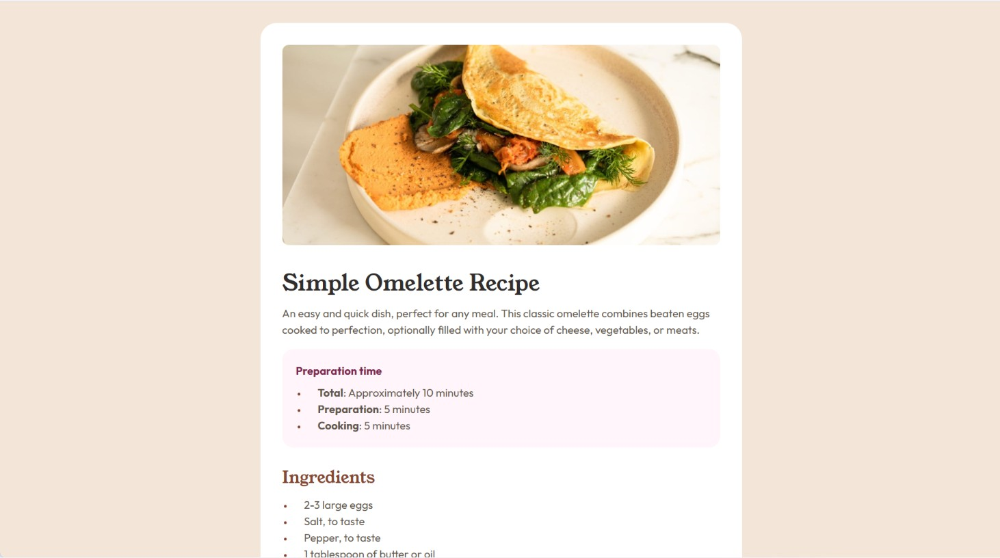

# Table of contents

- [Overview](#overview)
  - [Screenshot](#screenshot)
  - [Links](#links)
- [My process](#my-process)
  - [Built with](#built-with)
  - [What I learned](#what-i-learned)
  - [Continued development](#continued-development)
  - [Useful resources](#useful-resources)
  - [AI Collaboration](#ai-collaboration)
- [Author](#author)

## Overview

### Screenshot



### Links

- Solution URL: [https://github.com/bessoAgustin/recipe-page-main.git](https://github.com/bessoAgustin/recipe-page-main.git)
- Live Site URL: [https://bessoagustin.github.io/recipe-page-main/](https://bessoagustin.github.io/recipe-page-main/)

## My process

### Built with

- Semantic HTML5 markup
- CSS custom properties
- Flexbox
- Mobile-first workflow
- Media queries

### What I learned

This was a very interesting challenge. It gave me the opportunity to practice my skills handling multiple types of content and making them responsive. In particular, I learned how to use the `scope="row"` attribute in table headers to improve aaccessibility and readability of the table.

```html
        <tr>
          <th scope="row" class="macro">Fat</th>
          <td class="macro-amount">22g</td>
        </tr>
```
Also, I learned to manage pseudo-elements for a better visual representation of the content. For example, I used the `::marker` pseudo-element to adjust the size of bullet points before each ingredient in the list.

```css
ul li::marker{
    color: var(--color-brown-800);
    font-size: 0.8rem;
}
```

### Continued development

In the future, I would like to continue improving my skills in accessibility and responsive design. I also want to explore more advanced CSS techniques and possibly learn some JavaScript to enhance the interactivity of my projects.

### Useful resources

- [W3Schools pseudo-elements](https://www.w3schools.com/css/css_pseudo_elements.asp) - This helped me better understand how to use pseudo-elements for styling. I really liked this pattern and will use it going forward.
- ["Understanding the 'scope' attribute" in Reddit](https://www.reddit.com/r/Frontend/comments/1axqew3/help_me_understand_the_scope_attribute_and_its/) - This thread helped me understand concrete examples of how to use the `scope` attribute in a very clear and concise manner. I'd recommend it to anyone still learning this concept.

### AI Collaboration

I consulted Gemini when I felt stuck at any point or to go deeply into some concept, to make sure I was able to apply it correctly now and in the future for myself. I only came to Gemini after I had already tried to solve the problem myself and couldn't. I also used it to help me with some code refactoring and optimization, as well as to get feedback on my code structure and organization to ensure cleanliness and efficiency.

## Author

- Portfolio - [Agustín Besso](https://agustinbessoportfolio.vercel.app/)
